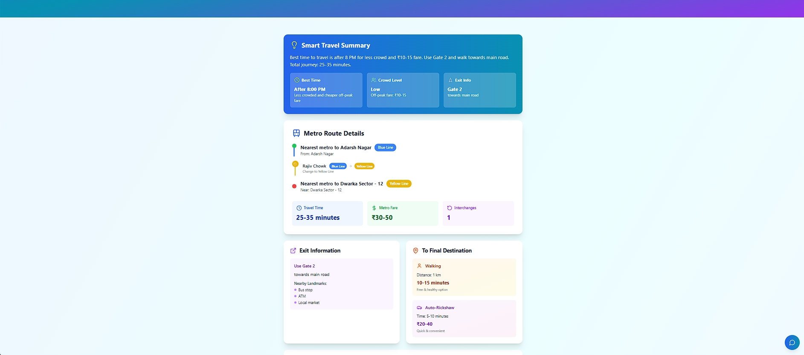

#  Smart Metro Planner using AI

An intelligent metro travel assistant that uses **Google Gemini (Generative AI)** to provide the **best metro route**, **smart seat suggestions**, **exit gate info**, and **personalized actions** after reaching your destination.

>  Built with **React + TypeScript + TailwindCSS + Google Gemini API**

---

##  Screenshots

| Home Page                       | Route Summary                             | Seat Finder                                   |
| ------------------------------- | ----------------------------------------- | --------------------------------------------- |
|  |  |  |

---

##  Features

###  Smart Route Planning

* Enter source & destination metro stations.
* Get the **best route** with travel time, fare, and **interchange suggestions**.
* Color-coded lines and tips for interchanges.

###  AI Travel Summary

* Gemini AI provides:

  * Crowd predictions
  * Best time to travel
  * Gate exit tips
  * Nearby landmarks at destination

###  Smart Seat Finder

* Predicts **where you’re likely to get a seat**.
* Based on time, crowd flow, station popularity, and boarding flexibility.
* Shows estimated **seat availability %**, waiting, or walking tips.

###  What Can I Do After Reaching?

* Personalized suggestions from AI:

  * Food spots
  * Tourist places
  * Local tips near destination

###  Final Mile Planner

* Walking or auto-rickshaw options after metro journey
* Shows estimated time and fare

---

##  Tech Stack

| Technology    | Purpose                          |
| ------------- | -------------------------------- |
| React + TS    | Frontend Framework & Type Safety |
| Tailwind CSS  | UI & Styling                     |
| Google Gemini | Generative AI Suggestions        |
| PapaParse     | GTFS (CSV) Metro Station Parser  |
| React Select  | Smart Dropdowns for Stations     |

---

##  How It Works

| Function                   | Description                                 |
| -------------------------- | ------------------------------------------- |
| `planMetroRoute()`         | Calls Gemini API for best route and summary |
| `getNextSuggestions()`     | Gives “after reaching” ideas using AI       |
| `getSmartSeatSuggestion()` | Predicts best chance for seating            |
| `GTFS Data`                | Used to populate metro station list         |

---

##  Setup Instructions

### 1. Clone the Repository

```bash
git clone https://github.com/your-username/smart-metro-planner.git
cd smart-metro-planner
```

### 2. Install Dependencies

```bash
npm install
```

### 3. Setup Environment Variables

Create a `.env` file in the root and add your Gemini API key:

```env
VITE_GEMINI_API_KEY=your_gemini_api_key_here
```

>  Replace `your_gemini_api_key_here` with your actual key from [Google AI Studio](https://makersuite.google.com/).

### 4. Run the App Locally

```bash
npm run dev
```

Visit the app at: [http://localhost:5173](http://localhost:5173)

---

## 🌍 Live Demo

>  *If deployed, add the actual link below:*

 [https://smartmetroai.netlify.app](https://smartmetroai.netlify.app)

---

##  Folder Structure

```plaintext
/src
  ├── components/
  │   ├── Header.tsx
  │   ├── LocationInput.tsx
  │   ├── RouteResults.tsx
  │   ├── SmartSeatFinder.tsx
  │   ├── NearbyRecommendations.tsx
  │   └── ChatBot.tsx
  ├── services/
  │   └── geminiService.ts
  ├── data/
  │   └── delhi-metro-gtfs/stops.txt
  ├── App.tsx
  └── main.tsx
```

---

##  Notes

* Make sure your API key has access to **Gemini 1.5**.
* GTFS data (`stops.txt`) is used for metro stations.
* Works best on latest Chrome-based browsers.

---

##  Author

Made by **Diksha Kumari Pareta**
GitHub: [@your-github](https://github.com/your-github)

---
